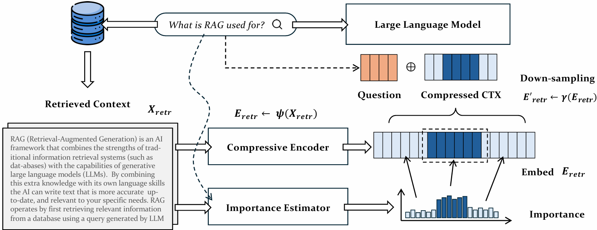

# <div align="center">Lighter And Better: Towards Flexible Context Adaptation For Retrieval Augmented Generation<div>

<div align="center">
<a href="https://arxiv.org/abs/2409.15699" target="_blank"></a>
<a href="https://dl.acm.org/doi/abs/10.1145/3701551.3703580" target="_blank"></a>
<a href="https://huggingface.co/wcyno23/FlexRAG" target="_blank"></a>
<a href="https://huggingface.co/datasets/wcyno23/TacZip-Data" target="_blank"></a>
<a href="https://github.com/"></a>
<a></a>
</div>
<h4 align="center">

## 👋 Overview

**FlexRAG** is a lightweight model designed to reduce RAG running costs while improving its generation quality. It compresses the retrieved contexts into compact embeddings and these embeddings are optimized to enhance downstream RAG performance. A key feature of FlexRAG is its flexibility, which enables effective support for diverse compression ratios and selective preservation of important contexts. 



## 🔥 News

- 2026-01-21: Training Resources Now Available

  The [training code](./examples/training.md) and [dataset](https://huggingface.co/datasets/wcyno23/TacZip-Data) are now officially released!

## ✨ Performance

| Model   | Compression Ratio | Exact Match | CUDA Time (s) | TFLOPs   |
| ------- | ----------------- | ----------- | ------------- | -------- |
| RAG     | 1×                | 37.25       | 7.78          | 14.17    |
| FlexRAG | 2×                | **47.23**   | 4.97          | 10.48    |
| FlexRAG | 4×                | 47.25       | 3.13          | 7.03     |
| FlexRAG | 8×                | 45.37       | 2.48          | 5.39     |
| FlexRAG | 16×               | 38.93       | **2.20**      | **4.59** |

## 🛠️ Set up

### Data

The evaluation dataset for FlexRAG is released [here](https://huggingface.co/datasets/wcyno23/FlexRAG-eval). Please download and unzip them to the `data` folder.

### Environment

You can install the necessary dependencies using the following command. Recommended Python version is 3.10+.

```bash
conda create -n flexrag python=3.10
conda activate flexrag
pip install -r requirements.txt
pip install flash-attn --no-build-isolation
```

## :rocket: Usage

### Evaluation

See [evaluation section](./examples/evaluation.md).

### Training

See [training section](./examples/training.md).

### Inference

#### Uniform compression

Here is an example of FlexRAG without selective compression. 

```python
import torch
import sys
import os
sys.path.append(os.path.abspath(os.path.join(os.path.dirname(__file__), "..")))
from src.model import load_model_and_tokenizer
from src.longbench.config import DATASET2PROMPT
from src.data import Data, FlexRAGCollator, INPUT_TAG, CONTEXT_TAG
from src.args import ModelArgs, LoraArgs

# 1. Load model & tokenizer
model_args = ModelArgs(model_name_or_path="meta-llama/Llama-2-7b-chat-hf", encoder_name_or_path="wcyno23/FlexRAG")
lora_args = LoraArgs()
model, tokenizer = load_model_and_tokenizer(model_args, lora_args)
model = model.cuda()
model.eval()
tokenizer.padding_side = "left"

# 2. Build a single hotpotqa-style prompt and configure compression-related parameters
question = "Who proposed the theory of general relativity?"
context = "At the beginning of the 20th century, physics was undergoing rapid change. Many scientists were trying to resolve inconsistencies between classical mechanics and new experimental results. In 1905, Albert Einstein introduced the theory of special relativity, which focused on the relationship between space and time. Over the next several years, Einstein continued his work on extending these ideas to include gravity. After years of development, the theory of general relativity was formally proposed by Albert Einstein, marking a major milestone in modern physics. The theory later became essential for understanding black holes, cosmology, and gravitational waves."
prompt = DATASET2PROMPT["hotpotqa"]
prompt = prompt.replace(INPUT_TAG, question)
content = prompt.replace(CONTEXT_TAG, context)
sample = {
    "conversations": [[
        {"role": "user", "content": content, "prompt": prompt, "context": context},
        {"role": "assistant", "content": None},
    ]]
}
overall_comp_ratio = 8

# 3. Tokenize
encoded = Data.encode_conversations_w_uniform_compression(sample, indices=[0], tokenizer=tokenizer, chat_template="llama-2", encoder_max_length=4096, lm_max_length=4096, comp_ratio=overall_comp_ratio)
encoded = {k: (v[0] if isinstance(v, list) and v is not None else v) for k, v in encoded.items()}

# 4. Use FlexRAGCollator to process inputs
collator = FlexRAGCollator(tokenizer=tokenizer)
inputs = collator([encoded])
# Move everything to model device
inputs = {k: v.to(model.device) if isinstance(v, torch.Tensor) else v for k, v in inputs.items()}
inputs = Data.format_inputs(inputs)

# 5. Generate
with torch.no_grad():
    output_ids = model.generate(
        **inputs,
        max_new_tokens=32,
        do_sample=False,
    )
output_text = tokenizer.decode(
    output_ids[0, inputs["input_ids"].shape[1]:],
    skip_special_tokens=True,
)
print('Question: ', question)
print('Answer: ', output_text)
```

#### Selective compression

The overall performance can be further improved by leveraging an importance estimator to analyze critical information within the context and subsequently allocate compression ratios. **Note:** this estimation introduces additional computational overhead.

Below is an example that uses the [all-MiniLM-L6-v2](sentence-transformers/all-MiniLM-L6-v2) embedding model to perform sentence-level importance estimation. The overall context is divided into two priority levels: `high-priority context` is assigned `lower compression ratios`, while low-priority context is assigned higher compression ratios. 

* `context_proportion` (`float`): The proportion of high-priority context.
* `low_comp_ratio` (`int`): Compression ratios assigned to high-priority context.

**Note**: Ensure that the values of `context_proportion` and `low_comp_ratio` are valid, so that the compression ratios for the remaining context can be computed correctly and the overall compression ratio is achievable.

```python
import torch
import sys
import os
sys.path.append(os.path.abspath(os.path.join(os.path.dirname(__file__), "..")))
from src.model import load_model_and_tokenizer
from src.longbench.config import DATASET2PROMPT
from src.data import Data, FlexRAGCollator, INPUT_TAG, CONTEXT_TAG
from src.args import ModelArgs, LoraArgs
from main_embedding.embedder import SentenceEmbedder
from main_embedding.prepare_longbench import encode_conversations_w_uniform_compression

# 1. Load model & tokenizer & embedding model 
model_args = ModelArgs(model_name_or_path="meta-llama/Llama-2-7b-chat-hf", encoder_name_or_path="wcyno23/FlexRAG")
lora_args = LoraArgs()
model, tokenizer = load_model_and_tokenizer(model_args, lora_args)
model = model.cuda()
model.eval()
tokenizer.padding_side = "left"
sentence_embedder = SentenceEmbedder(model_name="sentence-transformers/all-MiniLM-L6-v2")
sentence_embedder.sentence_model.to(model.device).eval()

# 2. Build a single hotpotqa-style prompt and configure compression-related parameters
question = "Who proposed the theory of general relativity?"
context = "At the beginning of the 20th century, physics was undergoing rapid change. Many scientists were trying to resolve inconsistencies between classical mechanics and new experimental results. In 1905, Albert Einstein introduced the theory of special relativity, which focused on the relationship between space and time. Over the next several years, Einstein continued his work on extending these ideas to include gravity. After years of development, the theory of general relativity was formally proposed by Albert Einstein, marking a major milestone in modern physics. The theory later became essential for understanding black holes, cosmology, and gravitational waves."
prompt = DATASET2PROMPT["hotpotqa"]
prompt = prompt.replace(INPUT_TAG, question)
content = prompt.replace(CONTEXT_TAG, context)
sample = {
    "conversations": [[
        {"role": "user", "content": content, "prompt": prompt, "context": context},
        {"role": "assistant", "content": None},
    ]]
}
overall_comp_ratio = 8
text_proportion = 1 / 16
low_comp_ratio = 1

# 3. perform sentence level importance estimation
sentence_begin_indices, sentence_priority_list, sentences_ids_list = encode_conversations_w_uniform_compression(sample, tokenizer=tokenizer, chat_template="llama-2", encoder_max_length=4096, lm_max_length=4096, comp_ratio=overall_comp_ratio, dataset_name="hotpotqa", sentence_embedder=sentence_embedder)
importance_sentence_dict = [{'sentence_begin_indices': sentence_begin_indices, "sentence_priority_list": sentence_priority_list, "sentences_ids_list": sentences_ids_list}]

# 4. Tokenize (same logic as training/eval)
encoded = Data.encode_conversations_sentence_level_sc(sample, indices=[0], tokenizer=tokenizer, chat_template="llama-2", encoder_max_length=4096, lm_max_length=4096, overall_comp_ratio=overall_comp_ratio, text_proportion=text_proportion, low_comp_ratio=low_comp_ratio, importance_sentence_dict=importance_sentence_dict)
encoded = {k: (v[0] if isinstance(v, list) and v is not None else v) for k, v in encoded.items()}

# 5. Use FlexRAGCollator to process inputs
collator = FlexRAGCollator(tokenizer=tokenizer)
inputs = collator([encoded])
# Move everything to model device
inputs = {k: v.to(model.device) if isinstance(v, torch.Tensor) else v for k, v in inputs.items()}
inputs = Data.format_inputs(inputs)

# 5. Generate
with torch.no_grad():
    output_ids = model.generate(
        **inputs,
        max_new_tokens=32,
        do_sample=False,
    )
output_text = tokenizer.decode(
    output_ids[0, inputs["input_ids"].shape[1]:],
    skip_special_tokens=True,
)
print('Question: ', question)
print('Answer: ', output_text)
```

For additional usage details, please refer [evaluation section](./examples/evaluation.md).

## ✍️ Citation

If you find this repository useful, please consider giving a star ⭐ and citation
```
@inproceedings{wu2025lighter,
  title={Lighter and better: Towards flexible context adaptation for retrieval augmented generation},
  author={Wu, Chenyuan and Shao, Ninglu and Liu, Zheng and Xiao, Shitao and Li, Chaozhuo and Zhang, Chen and Wang, Senzhang and Lian, Defu},
  booktitle={Proceedings of the Eighteenth ACM International Conference on Web Search and Data Mining},
  pages={271--280},
  year={2025}
}
```